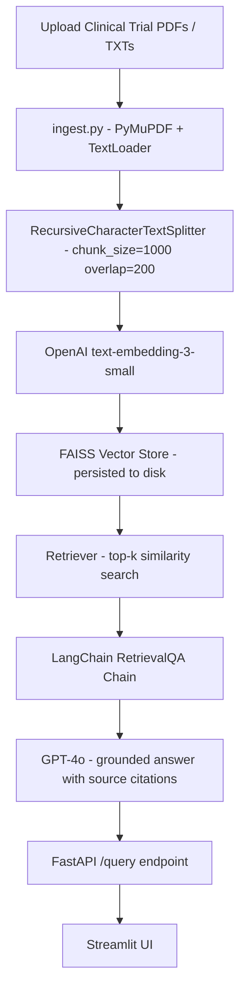

# 🔬 Project 11 — Clinical Trials Research Assistant


## 🧩 Business Problem
Clinical researchers spend hours manually searching through trial PDFs to find relevant precedents, eligibility criteria, outcomes, and methodology. A corpus of 50–200 trial documents is unmanageable without a retrieval layer. Researchers need to cross-reference hundreds of pages across dozens of documents just to answer a single question about dosage protocols or adverse event rates.

## 🎯 Project Objective
Build a RAG pipeline that:
- Ingests a corpus of clinical trial PDFs or text files
- Chunks, embeds, and stores them in a FAISS vector store
- Answers researcher questions with grounded answers and source citations
- Exposes a FastAPI endpoint and a Streamlit UI

> ⚠️ This tool does **not** provide medical advice. It retrieves and summarises from ingested documents only — clinical judgment stays with the professional.

## 🏗 System Architecture



## 🛠 Tech Stack
| Layer | Tool |
|---|---|
| LLM | OpenAI GPT-4o |
| Embeddings | OpenAI text-embedding-3-small |
| Vector Store | FAISS (local, persisted to disk) |
| RAG Framework | LangChain RetrievalQA |
| Document Loading | PyMuPDF (PDFs), TextLoader (TXT) |
| API | FastAPI + Uvicorn |
| Frontend | Streamlit |
| Language | Python 3.10+ |

## 📁 Folder Structure
```
project-11-clinical-trials-research-assistant/
├── app/
│   ├── ingest.py          # PDF/TXT ingestion + FAISS index builder
│   ├── retriever.py       # RAG chain setup with custom prompt
│   ├── api.py             # FastAPI /query endpoint
│   └── ui.py              # Streamlit frontend
├── tests/
│   └── test_retriever.py
├── samples/
│   └── sample_trials/     # 3 fictional trial summaries as .txt
├── vector_store/          # FAISS index saved here (gitignored)
├── .env.example
├── requirements.txt
└── README.md
```

## ⚙️ Setup

```bash
git clone <your-repo-url>
cd project-11-clinical-trials-research-assistant
python -m venv venv && source venv/bin/activate
pip install -r requirements.txt
cp .env.example .env          # Add your OPENAI_API_KEY
```

## 🚀 Usage
1. Ingest your trial documents: `python app/ingest.py --source samples/sample_trials/`
2. Start the API: `uvicorn app.api:app --reload --port 8000`
3. Open the UI: `streamlit run app/ui.py`
4. Type a research question — get a grounded answer with source citations

---

## Step-by-Step Implementation Guide

This guide walks you through building this project from scratch. Follow each step in order.

---

### Step 1: Project Setup

**1.1 — Create your project folder and virtual environment**

```bash
mkdir project-11-clinical-trials-research-assistant
cd project-11-clinical-trials-research-assistant
python -m venv venv
source venv/bin/activate          # Mac/Linux
venv\Scripts\activate             # Windows
```

A virtual environment keeps this project's packages isolated from other Python projects on your machine. Always activate it before working.

**1.2 — Create the folder structure**

```bash
mkdir app tests samples/sample_trials vector_store
touch app/ingest.py app/retriever.py app/api.py app/ui.py
touch tests/test_retriever.py
touch requirements.txt .env.example .env
```

**1.3 — Install dependencies**

Add to `requirements.txt`:
```
langchain>=0.2.0
langchain-openai>=0.1.0
langchain-community>=0.2.0
faiss-cpu>=1.7.4
pymupdf>=1.23.0
openai>=1.30.0
fastapi>=0.110.0
uvicorn>=0.29.0
streamlit>=1.35.0
requests>=2.31.0
python-dotenv>=1.0.0
pytest>=8.0.0
```

Then install:
```bash
pip install -r requirements.txt
```

**1.4 — Configure your API key**

`.env.example`:
```
OPENAI_API_KEY=sk-your-key-here
```

```bash
cp .env.example .env
# Open .env and paste your key
```

Get your key at [platform.openai.com](https://platform.openai.com) → API Keys → Create new secret key.

---

### Step 2: Understand the Folder Structure

```
app/
├── ingest.py    ← runs once — loads documents, splits, embeds, saves FAISS index to disk
├── retriever.py ← loads saved FAISS index, builds LangChain RetrievalQA chain
├── api.py       ← FastAPI server — calls retriever on each /query request
└── ui.py        ← Streamlit browser UI — calls the FastAPI server
```

**Why separate ingest from retrieval?** Ingestion is slow — it processes files and calls the embeddings API for every chunk. You only want to run it once (or when you add new documents). Retrieval is fast and runs on every user query. Keeping them separate means your API starts instantly without re-processing documents.

---

### Step 3: Build the Document Ingestion Pipeline (`app/ingest.py`)

The ingest script is the foundation of the entire RAG system — it builds the searchable database.

```python
"""
ingest.py — Ingests PDFs or TXT files, chunks them, embeds, and saves a FAISS index.
Usage: python app/ingest.py --source samples/sample_trials/
"""
import os, argparse
from pathlib import Path
from langchain_community.document_loaders import PyMuPDFLoader, TextLoader
from langchain.text_splitter import RecursiveCharacterTextSplitter
from langchain_openai import OpenAIEmbeddings
from langchain_community.vectorstores import FAISS
from dotenv import load_dotenv

load_dotenv()

CHUNK_SIZE    = 1000
CHUNK_OVERLAP = 200
INDEX_PATH    = "vector_store/clinical_trials"
```

**Why `CHUNK_SIZE = 1000` and `CHUNK_OVERLAP = 200`?** Each chunk is an independent unit stored in the vector database. If chunks are too small, they lose context. If too large, they dilute the signal — a 5,000-character chunk that answers question A also drags in unrelated text about question B, reducing retrieval precision. 1,000 characters with 200 overlap is a good starting point for dense scientific documents. The overlap ensures sentences split at a boundary still appear in at least one complete chunk.

```python
def load_documents(source_dir: str) -> list:
    docs = []
    for path in Path(source_dir).rglob("*"):
        if path.suffix.lower() == ".pdf":
            docs.extend(PyMuPDFLoader(str(path)).load())
        elif path.suffix.lower() == ".txt":
            docs.extend(TextLoader(str(path)).load())
    print(f"Loaded {len(docs)} document pages from {source_dir}")
    return docs
```

**Why both PDF and TXT loaders?** Real clinical trial repositories contain both scanned PDFs and plain-text exports. Supporting both makes the tool work without pre-converting files. `PyMuPDFLoader` uses the PyMuPDF C++ library — faster and more accurate than many alternatives.

```python
def chunk_documents(docs: list) -> list:
    splitter = RecursiveCharacterTextSplitter(
        chunk_size=CHUNK_SIZE,
        chunk_overlap=CHUNK_OVERLAP,
        separators=["\n\n", "\n", ". ", " ", ""],
    )
    chunks = splitter.split_documents(docs)
    print(f"Created {len(chunks)} chunks (size={CHUNK_SIZE}, overlap={CHUNK_OVERLAP})")
    return chunks
```

**Why `RecursiveCharacterTextSplitter` over a simple fixed-size split?** It tries to split on natural boundaries first: paragraph breaks (`\n\n`), then line breaks (`\n`), then sentences (`. `). It only falls back to splitting mid-word if it has no other choice. This means chunks are semantically coherent — they don't cut a sentence in half, which would confuse the embedding model.

```python
def build_index(chunks: list) -> None:
    embeddings = OpenAIEmbeddings(model="text-embedding-3-small")
    vectorstore = FAISS.from_documents(chunks, embeddings)
    os.makedirs(os.path.dirname(INDEX_PATH), exist_ok=True)
    vectorstore.save_local(INDEX_PATH)
    print(f"FAISS index saved to {INDEX_PATH}")

if __name__ == "__main__":
    parser = argparse.ArgumentParser()
    parser.add_argument("--source", default="samples/sample_trials/")
    args = parser.parse_args()
    docs   = load_documents(args.source)
    chunks = chunk_documents(docs)
    build_index(chunks)
```

**Why FAISS and not Pinecone?** FAISS runs locally — no API key, no monthly cost, no network latency. For a corpus of 50–200 trials that fits on a laptop, local FAISS is faster and simpler. You'd switch to Pinecone when you need multi-user access, automatic scaling, or the corpus exceeds local disk/RAM limits.

**Why `save_local`?** FAISS is in-memory by default — it disappears when the process exits. `save_local` serialises the index to two files (`index.faiss` and `index.pkl`) that `retriever.py` loads instantly at API startup, without re-embedding anything.

---

### Step 4: Build the RAG Chain (`app/retriever.py`)

```python
"""retriever.py — Loads the FAISS index and builds a LangChain RetrievalQA chain."""
import os
from langchain_openai import OpenAIEmbeddings, ChatOpenAI
from langchain_community.vectorstores import FAISS
from langchain.chains import RetrievalQA
from langchain.prompts import PromptTemplate
from dotenv import load_dotenv

load_dotenv()

INDEX_PATH = "vector_store/clinical_trials"

PROMPT_TEMPLATE = """
You are a clinical research assistant. Answer the question using ONLY the context below.
If the answer is not in the context, say "I could not find relevant information in the loaded trials."
Always cite the source document and page number at the end of your answer.

Context:
{context}

Question: {question}

Answer (with citations):
"""
```

**Why "ONLY the context below"?** Without this constraint, GPT-4o will draw on its training data to fill gaps — producing answers that sound authoritative but aren't grounded in your specific trials. For clinical research, ungrounded answers are dangerous. The word "ONLY" is a strong instruction that overrides the model's default helpful behaviour.

**Why require citations?** This forces the model to reference the retrieved chunk metadata, giving researchers a paper trail to verify every claim against the original document.

```python
def build_qa_chain(k: int = 5) -> RetrievalQA:
    embeddings   = OpenAIEmbeddings(model="text-embedding-3-small")
    vectorstore  = FAISS.load_local(INDEX_PATH, embeddings, allow_dangerous_deserialization=True)
    retriever    = vectorstore.as_retriever(search_type="similarity", search_kwargs={"k": k})
    prompt       = PromptTemplate(template=PROMPT_TEMPLATE, input_variables=["context", "question"])
    llm          = ChatOpenAI(model="gpt-4o", temperature=0.1)
    return RetrievalQA.from_chain_type(
        llm=llm,
        chain_type="stuff",
        retriever=retriever,
        return_source_documents=True,
        chain_type_kwargs={"prompt": prompt},
    )
```

**Why `temperature=0.1`?** Low temperature means the model picks the most statistically likely tokens — predictable and factual. For clinical research you want the same question to give the same answer, not a creative paraphrase each time.

**Why `chain_type="stuff"`?** "Stuff" concatenates all k retrieved chunks into one prompt. This is the simplest strategy and works well when k is small (5 chunks × 1,000 chars ≈ 5,000 chars, well within GPT-4o's 128k context window).

**Why `return_source_documents=True`?** The chain returns the actual LangChain Document objects that were retrieved. The API then extracts source filenames and page numbers from their metadata to surface in the UI.

---

### Step 5: Build the FastAPI Server (`app/api.py`)

```python
"""api.py — FastAPI endpoints"""
from fastapi import FastAPI, HTTPException
from fastapi.middleware.cors import CORSMiddleware
from pydantic import BaseModel
from retriever import build_qa_chain

app = FastAPI(title="Clinical Trials Research Assistant")
app.add_middleware(CORSMiddleware, allow_origins=["*"], allow_methods=["*"], allow_headers=["*"])

qa_chain = None

@app.on_event("startup")
def load_chain():
    global qa_chain
    try:
        qa_chain = build_qa_chain()
    except Exception as e:
        print(f"Warning: could not load QA chain: {e}")

class QueryRequest(BaseModel):
    question: str
    k: int = 5

class QueryResponse(BaseModel):
    answer: str
    sources: list[str]

@app.get("/health")
def health():
    return {"status": "ok", "index_loaded": qa_chain is not None}

@app.post("/query", response_model=QueryResponse)
def query(req: QueryRequest):
    if not qa_chain:
        raise HTTPException(503, "Vector index not loaded. Run ingest.py first.")
    result   = qa_chain.invoke({"query": req.question})
    sources  = list({
        doc.metadata.get("source", "Unknown") + f" p.{doc.metadata.get('page', '?')}"
        for doc in result.get("source_documents", [])
    })
    return QueryResponse(answer=result["result"], sources=sources)
```

**Why load the chain at startup?** `build_qa_chain()` loads the FAISS index from disk — this takes 1–3 seconds. If you did this on every request, every user would wait extra seconds before getting an answer. Loading once at startup means all requests can answer instantly.

**Why `503` for a missing index?** HTTP 503 means "Service Unavailable" — the server is running but can't fulfil the request. This is more informative than 500 because the client knows the fix: run `ingest.py`.

**Why deduplicate sources with a set?** The retriever returns k=5 chunks that may come from the same document page. Without deduplication, you'd show the same source three times.

---

### Step 6: Build the Streamlit UI (`app/ui.py`)

```python
"""ui.py — Streamlit frontend"""
import streamlit as st
import requests

API_URL = "http://localhost:8000"

st.set_page_config(page_title="Clinical Trials Research Assistant", page_icon="🔬", layout="wide")
st.title("🔬 Clinical Trials Research Assistant")
st.caption("Ask questions across your clinical trial corpus — get grounded answers with citations.")

with st.sidebar:
    st.header("Settings")
    k = st.slider("Documents to retrieve (k)", 2, 10, 5)
    st.caption("Make sure the FastAPI server is running on port 8000.")

question = st.text_input("Ask a question about the trial corpus",
    placeholder="e.g. What were the primary endpoints of trials studying diabetes treatment?")

if st.button("Search", type="primary") and question:
    with st.spinner("Searching corpus..."):
        try:
            resp = requests.post(f"{API_URL}/query", json={"question": question, "k": k}, timeout=30)
            resp.raise_for_status()
            data = resp.json()
            st.markdown("### Answer")
            st.markdown(data["answer"])
            if data["sources"]:
                st.markdown("### Sources")
                for src in data["sources"]:
                    st.markdown(f"- `{src}`")
        except requests.exceptions.ConnectionError:
            st.error("Cannot connect to API. Make sure uvicorn is running on port 8000.")
        except Exception as e:
            st.error(f"Error: {e}")
```

**Why keep the UI as a thin client?** The UI only sends questions and displays answers — all intelligence lives in the API. This means you can swap the UI for a React app, CLI, or Slack bot without changing any RAG logic. This separation of concerns is the most important architectural decision in this project.

**Why expose `k` in the sidebar?** Researchers can experiment with retrieval depth. More retrieved chunks = more context for GPT-4o, but also a larger and more expensive prompt. The slider makes this trade-off visible and controllable.

---

### Step 7: Run and Test

```bash
# Terminal 1 — ingest documents first
python app/ingest.py --source samples/sample_trials/

# Terminal 2 — start the API
uvicorn app.api:app --reload --port 8000

# Terminal 3 — launch the UI
streamlit run app/ui.py
```

**Test queries:**

| Question | Expected behaviour |
|---|---|
| "What were the primary endpoints in the diabetes trial?" | Answer from trial_001, with citation |
| "What adverse events were reported in oncology trials?" | Answer from trial_002, with citation |
| "What was the dropout rate?" | "Could not find relevant information" if not in corpus |

```bash
pytest tests/ -v
```

---

### Step 8: Troubleshooting

| Error | Cause | Fix |
|---|---|---|
| `FileNotFoundError: vector_store/...` | FAISS index not built yet | Run `python app/ingest.py --source samples/sample_trials/` first |
| `openai.AuthenticationError` | Invalid API key | Check `.env` has correct `OPENAI_API_KEY` |
| `503 Service Unavailable` | Index not loaded | Run ingest, then restart uvicorn |
| `ConnectionError` in Streamlit | API server not running | Start `uvicorn app.api:app --reload --port 8000` |
| Answer ignores the corpus | Prompt constraint missing | Ensure `PROMPT_TEMPLATE` still says "ONLY the context below" |
| `allow_dangerous_deserialization` warning | FAISS pickle security note | Safe to ignore for locally-created indexes |

---

## 📊 Evaluation Rubric
| Criteria | Meets | Exceeds |
|---|---|---|
| Functionality | Answers 5 test queries with citations | Handles 50+ docs, metadata filtering by trial phase |
| Code Quality | Ingestion and retrieval separated | Modular, typed, chunking strategy justified in comments |
| Architecture | FAISS + LangChain + FastAPI connected | Persistent index, chunk metadata stored and surfaced |
| Documentation | README + setup guide | Demo video + live URL |
| Business Framing | Problem stated | Quantified: hours saved per researcher per week |

## 🎤 Interview Talking Points
1. Why FAISS over Pinecone for this project?
2. How did you choose chunk size (1,000) and overlap (200)?
3. Why does the prompt say "ONLY the context below" — what happens without it?
4. How would you handle documents in multiple languages?
5. How would you evaluate RAG quality at scale?

## ⏱ Time Estimate
| Mode | Time |
|---|---|
| Self-paced | 14–18 hours |
| Instructor-guided | 7–10 hours |

## 🚀 Bonus Extensions
- Add metadata filtering by trial phase, year, or disease area
- Add a re-ranker (Cohere Rerank API) after initial FAISS retrieval to improve precision
- Deploy on AWS with S3 for document storage and ECS for the API
