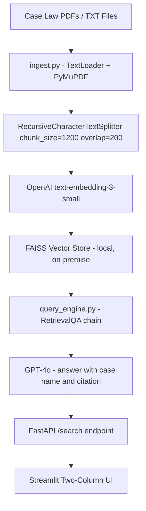

# ⚖️ Project 14 — Legal Precedent Finder


## 🧩 Business Problem
Junior lawyers spend days manually searching through case law databases to find precedents relevant to their current matter. A corpus of case summaries, judgments, and statute extracts needs a semantic retrieval layer so lawyers can ask questions in plain English and get cited, relevant precedents instantly — reducing research time from days to minutes.

## 🎯 Project Objective
Build a legal RAG system that:
- Ingests case law documents (judgments, case summaries, statute extracts)
- Stores them in a local FAISS index with source metadata
- Answers legal research questions with grounded answers and case citations
- Exposes a FastAPI search endpoint and a two-column Streamlit UI

> ⚠️ This tool does **not** provide legal advice. It retrieves relevant precedents for review by a qualified solicitor or barrister — all output requires professional legal judgment.

## 🏗 System Architecture



## 🛠 Tech Stack
| Layer | Tool |
|---|---|
| LLM | OpenAI GPT-4o |
| Embeddings | OpenAI text-embedding-3-small |
| Vector Store | FAISS (local, on-premise) |
| RAG Framework | LangChain RetrievalQA |
| Document Loading | PyMuPDF (PDFs), TextLoader (TXT) |
| API | FastAPI + Uvicorn |
| Frontend | Streamlit |
| Language | Python 3.10+ |

## 📁 Folder Structure
```
project-14-legal-precedent-finder/
├── app/
│   ├── ingest.py          # Case law ingestion + FAISS index builder
│   ├── query_engine.py    # Legal RAG chain with citation-enforcing prompt
│   ├── api.py             # FastAPI /search endpoint
│   └── ui.py              # Streamlit two-column UI
├── tests/
│   └── test_query_engine.py
├── samples/
│   └── case_law/          # 3 fictional UK negligence case summaries as .txt
├── vector_store/          # FAISS index (gitignored)
├── .env.example
├── requirements.txt
└── README.md
```

## ⚙️ Setup

```bash
git clone <your-repo-url>
cd project-14-legal-precedent-finder
python -m venv venv && source venv/bin/activate
pip install -r requirements.txt
cp .env.example .env    # Add your OPENAI_API_KEY
```

## 🚀 Usage
1. Ingest your case law corpus: `python app/ingest.py --source samples/case_law/`
2. Start the API: `uvicorn app.api:app --reload --port 8000`
3. Open the UI: `streamlit run app/ui.py`
4. Describe your matter in the left column — get cited precedents on the right

---

## Step-by-Step Implementation Guide

This guide walks you through building this project from scratch. Follow each step in order.

---

### Step 1: Project Setup

**1.1 — Create your project folder and virtual environment**

```bash
mkdir project-14-legal-precedent-finder
cd project-14-legal-precedent-finder
python -m venv venv
source venv/bin/activate          # Mac/Linux
venv\Scripts\activate             # Windows
```

**1.2 — Create the folder structure**

```bash
mkdir app tests samples/case_law vector_store
touch app/ingest.py app/query_engine.py app/api.py app/ui.py
touch tests/test_query_engine.py
touch requirements.txt .env.example .env
```

**1.3 — Install dependencies**

Add to `requirements.txt`:
```
langchain>=0.2.0
langchain-openai>=0.1.0
langchain-community>=0.2.0
faiss-cpu>=1.7.4
pymupdf>=1.23.0
openai>=1.30.0
fastapi>=0.110.0
uvicorn>=0.29.0
streamlit>=1.35.0
requests>=2.31.0
python-dotenv>=1.0.0
pytest>=8.0.0
```

```bash
pip install -r requirements.txt
```

**1.4 — Configure your API key**

`.env.example`:
```
OPENAI_API_KEY=sk-your-key-here
```

---

### Step 2: Why FAISS Instead of Pinecone for Legal Documents

The choice of FAISS here is deliberate. Legal documents often contain privileged client information and confidential case strategy. Uploading these to a third-party cloud vector database (like Pinecone) could constitute a breach of attorney-client privilege. FAISS runs entirely on-premise — data never leaves the firm's infrastructure. This is a genuine production consideration, not just a cost optimisation.

---

### Step 3: Build the Legal Document Ingestion (`app/ingest.py`)

```python
"""
ingest.py — Ingests case law documents and builds a FAISS index.
Usage: python app/ingest.py --source samples/case_law/
"""
import os, argparse
from pathlib import Path
from langchain_community.document_loaders import PyMuPDFLoader, TextLoader
from langchain.text_splitter import RecursiveCharacterTextSplitter
from langchain_openai import OpenAIEmbeddings
from langchain_community.vectorstores import FAISS
from dotenv import load_dotenv

load_dotenv()

CHUNK_SIZE    = 1200
CHUNK_OVERLAP = 200
INDEX_PATH    = "vector_store/legal_precedents"


def load_documents(source_dir: str) -> list:
    docs = []
    for path in Path(source_dir).rglob("*"):
        if path.suffix.lower() == ".pdf":
            docs.extend(PyMuPDFLoader(str(path)).load())
        elif path.suffix.lower() == ".txt":
            docs.extend(TextLoader(str(path)).load())
    print(f"Loaded {len(docs)} document pages from {source_dir}")
    return docs


def chunk_and_index(docs: list) -> None:
    splitter = RecursiveCharacterTextSplitter(
        chunk_size=CHUNK_SIZE,
        chunk_overlap=CHUNK_OVERLAP,
        separators=["\n\n", "\n", ". ", " ", ""],
    )
    chunks = splitter.split_documents(docs)
    print(f"Created {len(chunks)} chunks")

    embeddings  = OpenAIEmbeddings(model="text-embedding-3-small")
    vectorstore = FAISS.from_documents(chunks, embeddings)
    os.makedirs(os.path.dirname(INDEX_PATH), exist_ok=True)
    vectorstore.save_local(INDEX_PATH)
    print(f"FAISS index saved to {INDEX_PATH}")


if __name__ == "__main__":
    parser = argparse.ArgumentParser()
    parser.add_argument("--source", default="samples/case_law/")
    args = parser.parse_args()
    docs = load_documents(args.source)
    chunk_and_index(docs)
```

**Why `CHUNK_SIZE = 1200` for legal documents (vs 1,000 for clinical trials)?** Legal judgments are written in dense, continuous prose. A single holding — the core legal principle from a case — can span 3-4 long sentences. At 1,000 characters, you risk splitting a holding across two chunks, making it impossible to retrieve the complete principle. 1,200 characters preserves more full legal sentences per chunk, producing better retrieval quality for the specific structure of legal text.

**Why `separators=["\n\n", "\n", ". ", " ", ""]`?** Legal judgments have structured paragraphs separated by double newlines. By trying to split on `\n\n` first, the splitter keeps logical paragraphs together. It only falls back to sentence-level splitting (`. `) if a paragraph is longer than the chunk size. This hierarchy respects the document's natural structure.

---

### Step 4: Build the Legal Query Engine (`app/query_engine.py`)

```python
"""query_engine.py — Legal RAG chain with citation-enforcing prompt"""
import os
from langchain_openai import OpenAIEmbeddings, ChatOpenAI
from langchain_community.vectorstores import FAISS
from langchain.chains import RetrievalQA
from langchain.prompts import PromptTemplate
from dotenv import load_dotenv

load_dotenv()

INDEX_PATH = "vector_store/legal_precedents"

LEGAL_PROMPT = """
You are a legal research assistant supporting qualified solicitors and barristers.
Answer the question using ONLY the case law and statutes provided in the context below.
Do NOT provide legal advice, express opinions on case outcomes, or extrapolate beyond the provided text.

For every point you make, cite the specific case name and year in brackets, e.g. [Donoghue v Stevenson, 1932].
If the context does not contain relevant precedents, respond: "No relevant precedents found in the loaded corpus."

Context:
{context}

Legal Research Question: {question}

Research Summary (with citations):
"""


def build_query_engine(k: int = 6) -> RetrievalQA:
    embeddings  = OpenAIEmbeddings(model="text-embedding-3-small")
    vectorstore = FAISS.load_local(INDEX_PATH, embeddings, allow_dangerous_deserialization=True)
    retriever   = vectorstore.as_retriever(search_type="similarity", search_kwargs={"k": k})
    prompt      = PromptTemplate(template=LEGAL_PROMPT, input_variables=["context", "question"])
    llm         = ChatOpenAI(model="gpt-4o", temperature=0.0)
    return RetrievalQA.from_chain_type(
        llm=llm,
        chain_type="stuff",
        retriever=retriever,
        return_source_documents=True,
        chain_type_kwargs={"prompt": prompt},
    )
```

**Why `temperature=0.0` for legal research?** This is the lowest possible temperature, making GPT-4o completely deterministic — the same question gives the same answer every time. In legal contexts, inconsistent answers to the same question would be a serious problem. Temperature 0.0 eliminates all randomness.

**Why "Do NOT provide legal advice" in the prompt?** This is a professional liability guardrail. If the tool said "you should argue X" and the lawyer followed that advice and lost, there could be a claim against the software. By restricting output to summarising what the case law says (not advising what to do), the tool stays in its safe lane as a research aid, not a legal advisor.

**Why enforce citation format `[Case Name, Year]`?** Standardised citation format means a lawyer can immediately look up any cited case in a case law database like Westlaw or LexisNexis. Free-form citation (e.g., "see the Donoghue case") is harder to search. Specifying the exact format in the prompt enforces consistency across all responses.

**Why `k=6` for legal retrieval?** A legal question often needs supporting precedents from multiple angles — establishing duty of care, breach, causation, and remoteness of damage are four separate elements in negligence. k=6 gives enough chunks to cover different aspects of the legal question while staying within context limits.

---

### Step 5: Build the API (`app/api.py`)

```python
"""api.py — FastAPI /search endpoint"""
from fastapi import FastAPI, HTTPException
from fastapi.middleware.cors import CORSMiddleware
from pydantic import BaseModel
from query_engine import build_query_engine

app = FastAPI(title="Legal Precedent Finder")
app.add_middleware(CORSMiddleware, allow_origins=["*"], allow_methods=["*"], allow_headers=["*"])

engine = None

@app.on_event("startup")
def load_engine():
    global engine
    try:
        engine = build_query_engine()
    except Exception as e:
        print(f"Warning: could not load query engine: {e}")

class SearchRequest(BaseModel):
    matter_description: str
    k: int = 6

class SearchResponse(BaseModel):
    answer: str
    precedents: list[str]

@app.get("/health")
def health():
    return {"status": "ok", "engine_loaded": engine is not None}

@app.post("/search", response_model=SearchResponse)
def search(req: SearchRequest):
    if not engine:
        raise HTTPException(503, "Index not loaded. Run ingest.py first.")
    result     = engine.invoke({"query": req.matter_description})
    precedents = list({
        doc.metadata.get("source", "Unknown")
        for doc in result.get("source_documents", [])
    })
    return SearchResponse(answer=result["result"], precedents=precedents)
```

**Why `matter_description` instead of `question`?** Lawyers think in terms of "the matter" — the factual scenario their client presents. Using `matter_description` in the API matches legal terminology, making the API more intuitive for legal tech integrations.

---

### Step 6: Build the Two-Column Streamlit UI (`app/ui.py`)

```python
"""ui.py — Streamlit two-column research interface"""
import streamlit as st
import requests

API_URL = "http://localhost:8000"

st.set_page_config(page_title="Legal Precedent Finder", page_icon="⚖️", layout="wide")
st.title("⚖️ Legal Precedent Finder")
st.warning("⚠️ For research assistance only. All output requires review by a qualified legal professional.")

col_left, col_right = st.columns([1, 1], gap="large")

with col_left:
    st.subheader("Matter Description")
    matter = st.text_area(
        "Describe your client's legal situation",
        height=200,
        placeholder="e.g. Client suffered injury at a supermarket due to a wet floor without warning signs. No prior complaints recorded by the store."
    )
    k = st.slider("Precedents to retrieve", 3, 10, 6)
    search = st.button("Find Precedents", type="primary", use_container_width=True)

with col_right:
    st.subheader("Relevant Precedents")
    if search and matter:
        with st.spinner("Searching case law corpus..."):
            try:
                resp = requests.post(f"{API_URL}/search",
                    json={"matter_description": matter, "k": k}, timeout=30)
                resp.raise_for_status()
                data = resp.json()
                st.markdown(data["answer"])
                if data["precedents"]:
                    st.markdown("---")
                    st.caption("Source documents retrieved:")
                    for p in data["precedents"]:
                        st.caption(f"• {p}")
            except requests.exceptions.ConnectionError:
                st.error("Cannot connect to API. Start uvicorn first.")
            except Exception as e:
                st.error(f"Error: {e}")
    elif search:
        st.warning("Please enter a matter description.")
```

**Why two-column layout?** Legal research is a side-by-side activity — the matter description stays visible on the left while the researcher reads precedents on the right. This mirrors how lawyers work: matter facts on one screen, precedents on another. Streamlit's `st.columns` replicates this naturally.

---

### Step 7: Run and Test

```bash
# Terminal 1 — ingest case law
python app/ingest.py --source samples/case_law/

# Terminal 2 — start API
uvicorn app.api:app --reload --port 8000

# Terminal 3 — launch UI
streamlit run app/ui.py
```

**Test matters:**

| Matter | Expected precedent type |
|---|---|
| "Client injured on wet supermarket floor" | Negligence / duty of care cases |
| "Accountant gave negligent financial advice to third party" | Professional negligence, Caparo test |
| "Defective product caused injury to consumer" | Product liability, Donoghue principles |

```bash
pytest tests/ -v
```

---

### Step 8: Troubleshooting

| Error | Cause | Fix |
|---|---|---|
| `FileNotFoundError: vector_store/legal_precedents` | Index not built | Run `python app/ingest.py --source samples/case_law/` first |
| Model gives legal advice | Prompt guardrail not strong enough | Add "This is NOT legal advice" to the prompt explicitly |
| Citations are inconsistent format | Model not following format instruction | Add a few-shot example in the prompt showing `[Case Name, Year]` format |
| `503 Service Unavailable` | Engine not loaded at startup | Check ingest ran successfully before starting uvicorn |
| Wrong precedents returned | k too low | Increase k to 8–10 for more coverage |
| `allow_dangerous_deserialization` warning | FAISS security note | Safe for locally-created indexes |

---

## 📊 Evaluation Rubric
| Criteria | Meets | Exceeds |
|---|---|---|
| Functionality | Returns cited precedents for 5 test matters | Handles 50+ cases, jurisdiction filtering |
| Code Quality | Ingest and query engine separated | Typed, modular, privacy rationale documented |
| Architecture | FAISS + LangChain + FastAPI | On-premise rationale justified, k configurable |
| Documentation | README + setup guide | Demo GIF + practice area examples |
| Business Framing | Problem stated | Research hours saved per matter quantified |

## 🎤 Interview Talking Points
1. Why FAISS instead of Pinecone — what is the attorney-client privilege argument?
2. Why is chunk size 1,200 for legal text but 1,000 for clinical trials?
3. Why temperature 0.0 — and when would you use a higher temperature in a legal tool?
4. What does "do not provide legal advice" in the prompt actually prevent?
5. How would you handle a corpus with cases in multiple jurisdictions?

## ⏱ Time Estimate
| Mode | Time |
|---|---|
| Self-paced | 14–18 hours |
| Instructor-guided | 7–10 hours |

## 🚀 Bonus Extensions
- Add jurisdiction metadata to chunks and filter by jurisdiction (UK, US, EU) at query time
- Integrate with CourtListener public API to auto-download real case law
- Add a citation graph showing how ingested cases reference each other
