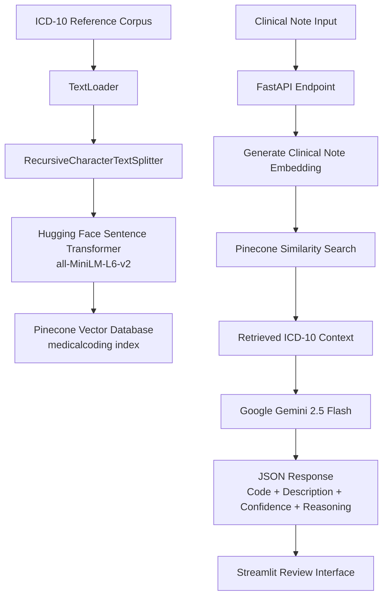

# 🏥 Project 17 — Medical Coding Automation Tool


## 🧩 Business Problem

Medical coders manually assign ICD-10 diagnosis codes from clinical notes. This process is time-consuming and error-prone, leading to:

* Claim denials
* Billing delays
* Revenue cycle inefficiencies
* Compliance risks

Hospitals process hundreds of clinical notes daily. An AI-assisted coding system can reduce manual search effort by providing ranked ICD-10 code suggestions with confidence scores and explanations.

⚠️ This tool assists certified medical coders. AI-generated suggestions must be reviewed and approved by qualified healthcare professionals before being used for billing or clinical documentation.

---

# 🎯 Project Objective

Build a Retrieval Augmented Generation (RAG) based medical coding assistant that:

* Ingests ICD-10 reference documentation into Pinecone
* Converts ICD-10 knowledge into semantic embeddings using Hugging Face Sentence Transformers
* Retrieves relevant diagnosis codes using vector similarity search
* Uses Google Gemini to generate ICD-10 suggestions with confidence scores and reasoning
* Exposes the solution through FastAPI
* Provides a Streamlit interface for reviewing AI-generated recommendations

---

# 🏗 System Architecture



---

# 🛠 Tech Stack

| Layer           | Technology                                             |
| --------------- | ------------------------------------------------------ |
| LLM             | Google Gemini 2.5 Flash                                |
| Embeddings      | Hugging Face Sentence Transformer (`all-MiniLM-L6-v2`) |
| Vector Database | Pinecone                                               |
| RAG Framework   | LangChain                                              |
| Backend API     | FastAPI + Uvicorn                                      |
| Frontend        | Streamlit                                              |
| Language        | Python 3.12                                            |

---

# 📁 Project Structure

```
project-17-medical-coding-automation-tool/

├── app/
│   ├── ingest.py          # ICD-10 ingestion pipeline
│   ├── coder.py           # RAG retrieval + Gemini generation
│   ├── api.py             # FastAPI endpoints
│   └── ui.py              # Streamlit interface
│
├── tests/
│   └── test_coder.py
│
├── samples/
│   └── icd10_reference.txt
│
├── .env
├── requirements.txt
└── README.md
```

---

# ⚙️ Setup

## Create Virtual Environment

```bash
python3.12 -m venv venv

source venv/bin/activate
```

---

## Install Dependencies

```bash
pip install -r requirements.txt
```

---

## Configure Environment Variables

Create `.env`

```env
GOOGLE_API_KEY=your_gemini_api_key

PINECONE_API_KEY=your_pinecone_api_key

PINECONE_INDEX=medicalcoding
```

---

# 📚 RAG Pipeline Explanation

## 1. ICD-10 Ingestion

The ingestion pipeline:

```
ICD-10 Reference File

        |
        |
Document Loader

        |
        |
Text Chunking

        |
        |
Hugging Face Embedding Model

        |
        |
Pinecone Vector Database
```

---

## 2. Embedding Model

The project uses:

```
sentence-transformers/all-MiniLM-L6-v2
```

This converts medical coding text into numerical vectors.

Example:

Input:

```
Type 2 diabetes with diabetic neuropathy
```

Output:

```
[0.234, 0.543, ...]
```

The vectors allow semantic similarity search.

Pinecone index configuration:

```
Dimension: 384
Metric: cosine similarity
```

---

## 3. Retrieval Process

User enters:

```
Patient has diabetes with numbness and tingling in feet
```

The system:

1. Creates an embedding for the clinical note
2. Searches Pinecone
3. Retrieves similar ICD-10 entries

Example:

Retrieved:

```
E11.40
Type 2 diabetes mellitus with diabetic neuropathy
```

---

## 4. Gemini Generation

Retrieved ICD-10 context and clinical note are sent to Gemini.

Prompt:

```
You are an AI medical coding assistant.

Using only the provided ICD-10 reference,
suggest appropriate diagnosis codes.

Return:
- ICD-10 code
- Description
- Confidence score
- Reasoning
```

Gemini response:

```json
[
 {
   "code":"E11.40",
   "description":"Type 2 diabetes mellitus with diabetic neuropathy",
   "confidence":0.92,
   "reasoning":"Clinical note indicates diabetes with neuropathy symptoms."
 }
]
```

---

# 🚀 Running the Application

## Step 1 — Ingest ICD-10 Data

Run once:

```bash
python app/ingest.py
```

Example output:

```
Created Pinecone index: medicalcoding

Ingested 53 ICD-10 reference chunks
```

---

## Step 2 — Start API Server

```bash
uvicorn app.api:app --reload --port 8000
```

API:

```
http://localhost:8000
```

---

## Step 3 — Launch Streamlit UI

```bash
streamlit run app/ui.py
```

---

# 🔌 API Example

## Request

POST:

```
/suggest-codes
```

Body:

```json
{
 "clinical_note":
 "Patient has type 2 diabetes with neuropathy"
}
```

---

## Response

```json
{
 "suggestions":[
  {
   "code":"E11.40",
   "description":"Type 2 diabetes mellitus with diabetic neuropathy",
   "confidence":0.92,
   "reasoning":"Symptoms match diabetic neuropathy."
  }
 ]
}
```

---

# 👨‍⚕️ Human Review Workflow

The current application provides AI-assisted suggestions.

Production workflow:

```
Clinical Note

      |

RAG + Gemini

      |

AI ICD-10 Suggestions

      |

Certified Medical Coder Review

      |

Accept / Modify / Reject

      |

Final Billing Code
```

The AI never directly submits billing codes.

---

# 📊 Evaluation Metrics

For production evaluation:

| Metric                | Purpose                                   |
| --------------------- | ----------------------------------------- |
| Retrieval Accuracy    | Did Pinecone retrieve relevant ICD codes? |
| Faithfulness          | Did Gemini use retrieved context only?    |
| Code Accuracy         | Match with certified coder decisions      |
| Latency               | API response time                         |
| Human Correction Rate | How often coders modify AI output         |

Recommended tools:

* LangSmith
* RAGAS

---

# 🔮 Future Enhancements

## Human-in-the-loop Review Portal

Add:

* Coder authentication
* Approve/reject workflow
* Audit logging
* Feedback storage

## CPT Procedure Coding

Extend the system with a second RAG pipeline for:

* CPT codes
* HCPCS codes
* Procedure recommendations

## Enterprise Deployment

Possible architecture:

```
EHR System

     |

FastAPI AI Service

     |

Pinecone

     |

Gemini

     |

Coder Review Portal

     |

Audit Database
```

---

# 🎤 Interview Explanation

> "I built a healthcare RAG application that assists medical coders by retrieving relevant ICD-10 codes from a Pinecone vector database and using Gemini 2.5 Flash to generate ranked suggestions with confidence scores. ICD-10 documents are embedded using Hugging Face Sentence Transformers. The retrieved context is passed to Gemini to reduce hallucination and ensure grounded recommendations. The solution is exposed through FastAPI and Streamlit, with a human review workflow planned for production compliance."
