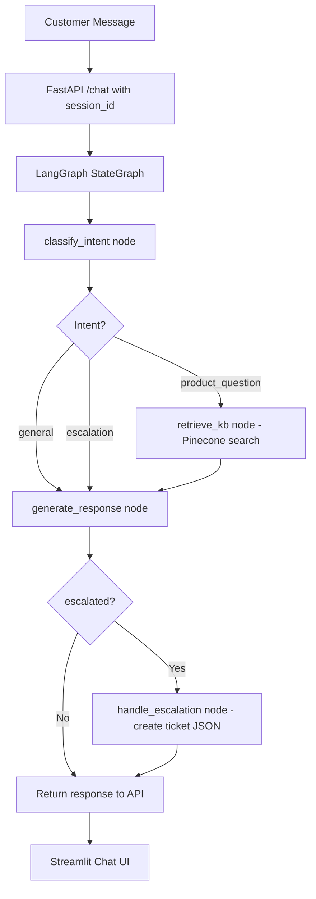

# 💬 Project 19 — AI Customer Support Agent with Memory


## 🧩 Business Problem
SaaS support teams answer the same product questions repeatedly — pricing, cancellation, integrations — while customers must re-explain their issue every time they open a new chat. An AI agent with a knowledge base (FAQ/product docs) and per-session conversation memory resolves repetitive queries instantly, maintains context across the conversation, and automatically creates support tickets for complex cases that need human escalation.

## 🎯 Project Objective
Build a LangGraph support agent that:
- Ingests a product knowledge base into Pinecone for semantic retrieval
- Classifies each message as a product question, general query, or escalation request
- Retrieves relevant KB articles for product questions
- Generates helpful, contextual responses using the last 6 messages of conversation history
- Creates a local support ticket when a customer requests human escalation
- Exposes a session-based FastAPI endpoint and a Streamlit chat interface

## 🏗 System Architecture



## 🛠 Tech Stack
| Layer | Tool |
|---|---|
| Agent Framework | LangGraph (StateGraph) |
| LLM | OpenAI GPT-4o |
| Embeddings | OpenAI text-embedding-3-small |
| Vector Store | Pinecone (knowledge base) |
| Ticket Logging | Local JSON files (swap for Zendesk in production) |
| API | FastAPI + Uvicorn |
| Frontend | Streamlit chat interface |
| Language | Python 3.10+ |

## 📁 Folder Structure
```
project-19-ai-customer-support-agent-with-memory/
├── app/
│   ├── agent.py           # LangGraph StateGraph: classify → retrieve → respond → escalate
│   ├── kb_ingest.py       # Knowledge base ingestion into Pinecone
│   ├── ticket_logger.py   # Creates JSON support tickets locally
│   ├── api.py             # FastAPI /chat with session_id + conversation history
│   └── ui.py              # Streamlit chat interface with escalation banner
├── tests/
│   └── test_agent.py
├── samples/
│   ├── sample_knowledge_base.txt   # ACME SaaS product FAQ / docs
│   └── tickets/                   # Ticket JSON files written here
├── .env.example
├── requirements.txt
└── README.md
```

## ⚙️ Setup

```bash
git clone <your-repo-url>
cd project-19-ai-customer-support-agent-with-memory
python -m venv venv && source venv/bin/activate
pip install -r requirements.txt
cp .env.example .env    # Add OPENAI_API_KEY, PINECONE_API_KEY, PINECONE_INDEX
```

## 🚀 Usage
1. Ingest the knowledge base: `python app/kb_ingest.py`
2. Start the API: `uvicorn app.api:app --reload --port 8000`
3. Open the chat UI: `streamlit run app/ui.py`
4. Chat with the agent — say "I want to speak to a human" to test escalation

---

## Step-by-Step Implementation Guide

This guide walks you through building this project from scratch. Follow each step in order.

---

### Step 1: Project Setup

**1.1 — Create your project folder and virtual environment**

```bash
mkdir project-19-ai-customer-support-agent-with-memory
cd project-19-ai-customer-support-agent-with-memory
python -m venv venv
source venv/bin/activate          # Mac/Linux
venv\Scripts\activate             # Windows
```

**1.2 — Create the folder structure**

```bash
mkdir app tests samples/tickets
touch app/agent.py app/kb_ingest.py app/ticket_logger.py app/api.py app/ui.py
touch tests/test_agent.py
touch requirements.txt .env.example .env
```

**1.3 — Install dependencies**

Add to `requirements.txt`:
```
langgraph>=0.1.0
langchain>=0.2.0
langchain-openai>=0.1.0
langchain-community>=0.2.0
langchain-pinecone>=0.1.0
pinecone-client>=3.0.0
openai>=1.30.0
fastapi>=0.110.0
uvicorn>=0.29.0
streamlit>=1.35.0
requests>=2.31.0
python-dotenv>=1.0.0
pytest>=8.0.0
```

```bash
pip install -r requirements.txt
```

---

### Step 2: Ingest the Knowledge Base (`app/kb_ingest.py`)

```python
"""kb_ingest.py — Ingest knowledge base into Pinecone"""
import os
from langchain_community.document_loaders import TextLoader
from langchain.text_splitter import RecursiveCharacterTextSplitter
from langchain_openai import OpenAIEmbeddings
from langchain_pinecone import PineconeVectorStore
from pinecone import Pinecone, ServerlessSpec
from dotenv import load_dotenv

load_dotenv()
INDEX_NAME = os.getenv("PINECONE_INDEX", "support-kb")


def ingest_kb(source: str = "samples/sample_knowledge_base.txt"):
    pc = Pinecone(api_key=os.getenv("PINECONE_API_KEY"))
    if INDEX_NAME not in [i.name for i in pc.list_indexes()]:
        pc.create_index(INDEX_NAME, dimension=1536,
                        spec=ServerlessSpec(cloud="aws", region="us-east-1"))

    docs     = TextLoader(source).load()
    splitter = RecursiveCharacterTextSplitter(chunk_size=500, chunk_overlap=80)
    chunks   = splitter.split_documents(docs)

    embeddings = OpenAIEmbeddings(model="text-embedding-3-small")
    PineconeVectorStore.from_documents(chunks, embeddings, index_name=INDEX_NAME)
    print(f"Ingested {len(chunks)} KB chunks into Pinecone")


if __name__ == "__main__":
    ingest_kb()
```

**Why `chunk_size=500` for a product knowledge base?** Product FAQ entries are short and self-contained — "Starter plan costs $29/month, includes 5 users." At 500 characters, each chunk maps closely to one FAQ topic. Larger chunks would group unrelated topics (pricing mixed with cancellation policy), making retrieval less precise — a customer asking about pricing would also retrieve cancellation information in the same chunk.

---

### Step 3: Build the LangGraph Agent (`app/agent.py`)

```python
"""agent.py — LangGraph support agent"""
import os
from typing import TypedDict, Annotated
import operator
from langgraph.graph import StateGraph, END
from langchain_openai import ChatOpenAI, OpenAIEmbeddings
from langchain_pinecone import PineconeVectorStore
from dotenv import load_dotenv

load_dotenv()

llm        = ChatOpenAI(model="gpt-4o", temperature=0.3)
INDEX_NAME = os.getenv("PINECONE_INDEX", "support-kb")


class AgentState(TypedDict):
    session_id:   str
    user_message: str
    intent:       str           # "product_question" | "general" | "escalation"
    kb_context:   str
    response:     str
    history:      Annotated[list, operator.add]
    escalated:    bool
```

**Why `Annotated[list, operator.add]` for history?** LangGraph nodes return partial state updates — each node only returns the keys it changed. Using `operator.add` as a reducer means each node can append to history by returning `{"history": [new_item]}` and LangGraph automatically accumulates the list. Without this annotation, a node returning `{"history": [new_item]}` would overwrite the entire history list instead of appending to it.

```python
def classify_intent(state: AgentState) -> dict:
    msg = state["user_message"].lower()
    if any(w in msg for w in ["speak to human", "agent", "escalate", "manager", "complaint"]):
        return {"intent": "escalation"}
    elif any(w in msg for w in ["how", "what", "why", "when", "price", "feature", "plan", "billing", "cancel"]):
        return {"intent": "product_question"}
    else:
        return {"intent": "general"}
```

**Why keyword-based intent classification instead of LLM?** Keywords are deterministic, instant, and free — no API call needed. For the most critical classification (is this an escalation request?), keywords like "speak to human" and "escalate" are highly reliable. Using an LLM classifier would add 500ms+ and cost to every single message. The keyword approach correctly handles the most important cases; misclassified edge cases fall into "general" which still produces a helpful response.

```python
def retrieve_kb(state: AgentState) -> dict:
    if state["intent"] != "product_question":
        return {"kb_context": ""}
    embeddings  = OpenAIEmbeddings(model="text-embedding-3-small")
    vectorstore = PineconeVectorStore(index_name=INDEX_NAME, embedding=embeddings)
    docs = vectorstore.similarity_search(state["user_message"], k=4)
    return {"kb_context": "\n".join(d.page_content for d in docs)}
```

**Why only retrieve KB for `product_question` intent?** KB retrieval makes a Pinecone API call and adds latency. For "general" queries ("Hello!", "Thanks") and escalations, KB context is irrelevant. Skipping retrieval for those intents makes the agent faster and cheaper. This conditional logic is a simple but important optimisation.

```python
def generate_response(state: AgentState) -> dict:
    history_str = "\n".join(
        f"{m['role'].title()}: {m['content']}" for m in state["history"][-6:]
    )
    if state["intent"] == "escalation":
        return {"response": "I understand you'd like to speak with a human agent. "
                "I'm creating a support ticket now and a team member will be in touch within 2 hours.",
                "escalated": True}

    context = f"Knowledge Base:\n{state['kb_context']}\n\n" if state["kb_context"] else ""
    prompt  = f"""You are a helpful, friendly customer support agent.
{context}Conversation history:
{history_str}

Customer: {state['user_message']}

Provide a helpful, concise response. If you don't know, say so honestly and offer to escalate."""
    resp = llm.invoke(prompt)
    return {"response": resp.content, "escalated": False}


def should_escalate(state: AgentState) -> str:
    return "escalate" if state.get("escalated") else "done"


def handle_escalation(state: AgentState) -> dict:
    from ticket_logger import log_ticket
    ticket_id = log_ticket(state["session_id"], state["user_message"], state["history"])
    return {"response": state["response"] + f" (Ticket: {ticket_id})"}


def build_support_agent():
    g = StateGraph(AgentState)
    g.add_node("classify",  classify_intent)
    g.add_node("retrieve",  retrieve_kb)
    g.add_node("respond",   generate_response)
    g.add_node("escalate",  handle_escalation)
    g.set_entry_point("classify")
    g.add_edge("classify", "retrieve")
    g.add_edge("retrieve", "respond")
    g.add_conditional_edges("respond", should_escalate, {"escalate": "escalate", "done": END})
    g.add_edge("escalate", END)
    return g.compile()
```

**Why `history[-6:]` in the response prompt?** Passing the full conversation history would grow the prompt with every turn — eventually hitting context limits and increasing costs. The last 6 messages (3 turns) captures enough context for the agent to reference recent topics ("as I mentioned...") without carrying irrelevant early conversation. For a support chat, the last 3 turns is almost always sufficient context.

**Why `temperature=0.3` for response generation?** Support responses need to sound natural and friendly — too low (0.0) produces robotic, repetitive phrasing. But they also need to be accurate — too high produces creative hallucinations about product features. 0.3 is a balance: warm and conversational while staying factual.

**Why `add_conditional_edges` for escalation?** The escalation path only activates when `escalated=True`. For the majority of conversations that never escalate, the `handle_escalation` node is never called. `add_conditional_edges` implements this routing cleanly — the graph chooses its path based on state, not if/else logic in the node code.

---

### Step 4: Build the Ticket Logger (`app/ticket_logger.py`)

```python
"""ticket_logger.py — Local JSON ticket store"""
import json, os
from datetime import datetime

TICKET_DIR = "samples/tickets"


def log_ticket(session_id: str, user_message: str, conversation: list) -> str:
    os.makedirs(TICKET_DIR, exist_ok=True)
    ticket_id = f"TKT-{datetime.now().strftime('%Y%m%d%H%M%S')}"
    ticket = {
        "ticket_id":    ticket_id,
        "session_id":   session_id,
        "created_at":   datetime.now().isoformat(),
        "status":       "open",
        "user_message": user_message,
        "conversation": conversation,
    }
    path = os.path.join(TICKET_DIR, f"{ticket_id}.json")
    with open(path, "w") as f:
        json.dump(ticket, f, indent=2)
    return ticket_id
```

**Why a separate `ticket_logger.py`?** The agent shouldn't know whether tickets go to a JSON file, Zendesk, Freshdesk, or a database. By keeping ticket logging in its own file, swapping from local files to Zendesk requires changing only `ticket_logger.py` — the agent code stays identical. This is the **single responsibility principle** applied at the file level.

**Why include the full conversation in the ticket?** When a human agent picks up the ticket, they need context — they shouldn't have to ask the customer to repeat everything. The full conversation JSON gives them everything the AI saw, making human handoff seamless.

---

### Step 5: Build the API and Chat UI

**`app/api.py`:**
```python
"""api.py — FastAPI with session management"""
import uuid
from fastapi import FastAPI
from fastapi.middleware.cors import CORSMiddleware
from pydantic import BaseModel
from agent import build_support_agent, AgentState

app   = FastAPI(title="Customer Support Agent")
agent = build_support_agent()
app.add_middleware(CORSMiddleware, allow_origins=["*"], allow_methods=["*"], allow_headers=["*"])

sessions: dict[str, list] = {}   # session_id -> conversation history

class ChatRequest(BaseModel):
    session_id: str = ""
    message: str

@app.get("/health")
def health(): return {"status": "ok"}

@app.post("/chat")
def chat(req: ChatRequest):
    session_id = req.session_id or str(uuid.uuid4())
    history    = sessions.get(session_id, [])
    history.append({"role": "user", "content": req.message})

    result = agent.invoke({
        "session_id":   session_id,
        "user_message": req.message,
        "intent":       "",
        "kb_context":   "",
        "response":     "",
        "history":      history,
        "escalated":    False,
    })
    response = result["response"]
    history.append({"role": "assistant", "content": response})
    sessions[session_id] = history

    return {"session_id": session_id, "response": response,
            "escalated": result.get("escalated", False)}
```

**Why store conversation history in `sessions` dict at the API layer?** The API is the right place to manage session state across HTTP requests — each request is stateless on its own. The agent graph receives the full history on every call, so it can always reference prior turns. In production, you'd replace the in-memory dict with Redis so history survives server restarts and works across multiple API instances.

**`app/ui.py`:**
```python
"""ui.py — Streamlit chat interface"""
import uuid, requests
import streamlit as st

API_URL = "http://localhost:8000"
st.set_page_config(page_title="Customer Support", page_icon="💬", layout="centered")
st.title("💬 Customer Support")

if "session_id" not in st.session_state:
    st.session_state.session_id = str(uuid.uuid4())
if "messages" not in st.session_state:
    st.session_state.messages = []

for msg in st.session_state.messages:
    with st.chat_message(msg["role"]):
        st.markdown(msg["content"])

if prompt := st.chat_input("How can I help you?"):
    st.session_state.messages.append({"role": "user", "content": prompt})
    with st.chat_message("user"): st.markdown(prompt)
    with st.chat_message("assistant"):
        with st.spinner("..."):
            try:
                resp = requests.post(f"{API_URL}/chat",
                    json={"session_id": st.session_state.session_id, "message": prompt}, timeout=30)
                data = resp.json()
                st.markdown(data["response"])
                if data.get("escalated"):
                    st.warning("Your query has been escalated to a human agent.")
                st.session_state.messages.append({"role": "assistant", "content": data["response"]})
            except Exception as e:
                st.error(f"Error: {e}")
```

**Why show an escalation warning banner?** When `escalated=True`, the customer needs clear confirmation that a human will follow up. Without the banner, they might keep chatting with the AI assuming it's handling their escalation request — creating confusion. The warning (`st.warning`) is visually distinct from regular chat messages, making the state change unmistakable.

---

### Step 6: Run and Test

```bash
# Terminal 1 — ingest KB
python app/kb_ingest.py

# Terminal 2 — start API
uvicorn app.api:app --reload --port 8000

# Terminal 3 — launch UI
streamlit run app/ui.py
```

**Test conversations:**

| Customer says | Expected intent | Expected behaviour |
|---|---|---|
| "Hello!" | general | Friendly greeting, no KB retrieval |
| "How much does the Professional plan cost?" | product_question | KB retrieved, returns $99/month |
| "Can I cancel at any time?" | product_question | KB retrieved, returns cancellation policy |
| "I want to speak to a human agent" | escalation | Ticket created, warning banner shown |

```bash
pytest tests/ -v
```

---

### Step 7: Troubleshooting

| Error | Cause | Fix |
|---|---|---|
| Agent always escalates | Keyword list too broad | Check `classify_intent` — "agent" in message triggers escalation; add more context |
| KB context empty for product questions | Pinecone index empty | Run `python app/kb_ingest.py` first |
| Session history not persisting | Different session_id each request | Store session_id in `st.session_state` and reuse it |
| Ticket files not created | `samples/tickets/` directory missing | `ticket_logger.py` calls `os.makedirs` — check write permissions |
| `langgraph` import error | Wrong package name | Install `langgraph>=0.1.0` not `langraph` |
| Agent responds but ignores KB | KB context not passed to prompt | Check `generate_response` includes `context` in prompt when `kb_context` is not empty |

---

## 📊 Evaluation Rubric
| Criteria | Meets | Exceeds |
|---|---|---|
| Functionality | Answers KB questions, escalation creates ticket | Conversation memory works across 5+ turns |
| Code Quality | 5 files with single responsibilities | Typed state, each node unit-tested independently |
| Architecture | LangGraph + Pinecone + session history | Conditional escalation routing, KB skipped for general queries |
| Documentation | README + setup guide | Demo video showing full conversation arc with escalation |
| Business Framing | Problem stated | Support ticket volume reduction and CSAT improvement quantified |

## 🎤 Interview Talking Points
1. Why LangGraph instead of a simple if/else chain for the support agent?
2. Why use keywords for intent classification instead of an LLM?
3. What does `Annotated[list, operator.add]` do in the state definition?
4. Why store conversation history at the API layer rather than inside the agent?
5. How would you replace local JSON tickets with Zendesk in production?

## ⏱ Time Estimate
| Mode | Time |
|---|---|
| Self-paced | 16–20 hours |
| Instructor-guided | 8–11 hours |

## 🚀 Bonus Extensions
- Replace keyword classifier with GPT-4o mini for more nuanced intent detection
- Add Zendesk API integration in `ticket_logger.py` — create real tickets with customer metadata
- Add sentiment analysis node to prioritise angry or frustrated customers for immediate human follow-up
